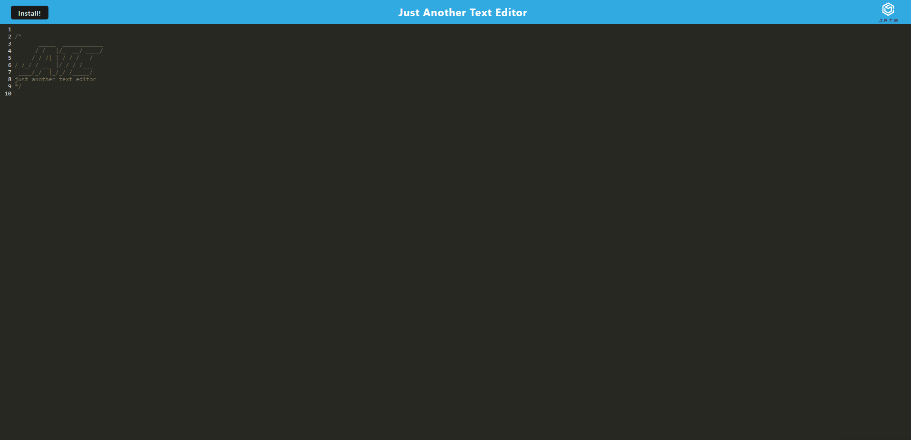

# JATE - Just Another Text Editor

Heroku link: https://stormy-tundra-28366-a7faafb73d05.herokuapp.com/

JATE is a simple text editor web application built with modern web technologies. It allows users to write and save text content, supporting offline access using Service Workers and IndexedDB for data storage. The editor provides syntax highlighting for JavaScript code using CodeMirror.

## Features
Create and edit text content in a user-friendly editor.
Automatic data synchronization and offline access using Service Workers and IndexedDB.
Syntax highlighting for JavaScript code snippets.
Installable as a Progressive Web App (PWA) for an enhanced user experience.
Deployed on Heroku for easy access and sharing.

## How to Use
Visit the live demo link above or deploy the project on your local development environment.
Start typing and editing text content in the editor.
The editor will automatically save your content locally and synchronize it when the internet connection is available.
The app is installable as a Progressive Web App (PWA) for enhanced accessibility and offline access.
## Technologies Used
HTML, CSS, and JavaScript for the frontend user interface.
CodeMirror for syntax highlighting of JavaScript code.
IndexedDB for local data storage.
Service Workers for offline access and caching.
Webpack for bundling and building the application.
Heroku for hosting and deploying the application.
## Installation and Setup
To run JATE on your local development environment, follow these steps:

1. Clone the repository
2. Run npm install
3. Run npm run start:dev. It will be at http://localhost:3000/

## Contributing
Contributions to JATE are welcome! If you find any issues or have suggestions for improvement, feel free to open an issue or submit a pull request.

## License
This project is licensed under the MIT License.

